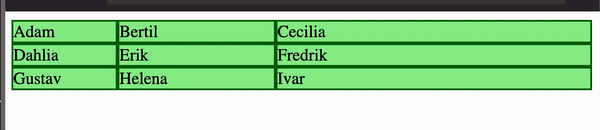

# Webbutveckling 1 av Paul Belfrage

[Länk till denna sida](https://paubel.github.io/webbutveckling1/)

# 1. Om läromedlets uppbyggnad

En bra uppsättning filmer där jag gå igenom grunderna i hur man gör moderna webbsidor. Filmerna tar upp liknade saker som i boken men är inte övningar i boken. [Länk till spellistan](https://www.youtube.com/watch?v=BCqcBps5jOM&list=PLNadygDF_9TFqwOOsb3FHVsoBQkyjw6tn&ab_channel=PaulBelfrage)

Spellistans innehåll

1. Installera VS Code del 1 - nerladdning av VS Code - installation
2. Installera VS Code del 2 - skapa en fil
3. Installera VS Code del 3 - Emmet - W3C validation
4. Installera VS Code del 4 - Live Server - byta färg i CSS
5. Installera VS Code del 5 - color theme - icon theme - color highlight - image preview
6. Installera VS Code del 6 - autokommentering
7. upp1 - del1 - doctype meta h1 img p
8. upp1 - del2 - img css color font-family em rem px
9. Github pages 2020
10. upp2 - Webbens historia
11. upp3 - Lagar
12. upp4 - del1 - rep github rgb hsl hex
13. upp4 - del2 a hover flex grid
14. upp5 - del1 start semantiska element
15. upp5 - del2 link to css
16. upp5 - del3 link to reset upp5
17. upp5 - del4 header cointainer
18. upp5 - del5 flex color scheme
19. upp5 - del6 flex just align
20. upp5 - del7 desktop for index
21. upp5 - del8 html contact desktop label input
22. upp5 - del9 html contact desktop CSS
23. upp5 - del10 html contact CSS grid
24. uppg6 - del1 - Figma ECA- index desktop
25. uppg6 - del2 - Figma ECA - hitta desktop
26. uppg6 - del3 - Figma ECA - dela
27. uppg6 - del4 - Figma AC form mobil

## 1.1 Om hur engelska är ett måste för att behärska webben

## 1.2 Kompanionsida

# 2. Installation av Visual studio Code och Hello world med HTML och CSS

[Länk till film som visar installation av VS Code - del 1-6.](https://www.youtube.com/watch?v=BCqcBps5jOM&list=PLNadygDF_9TFqwOOsb3FHVsoBQkyjw6tn&ab_channel=PaulBelfrage) Tänk på att du inte behöver lägga till alla extentions som visas i filmerna. Det jag rekomenderar är

- Live Server av Ritwick Dey
- W3C Web Validator av Celian Riboulet

[Länk till Visual Studio Code](https://code.visualstudio.com)

# 3. En kort historik om webben

[W3C](https://www.w3.org/about/history/)

[ADSL](https://en.wikipedia.org/wiki/ADSL)

[surfa på webben](https://it-ord.idg.se/ord/surfning/)

[Uppkoppling till internet 1969 - 2003](https://docs.google.com/spreadsheets/d/1fgWcUDBK9RMW_CsseeGX5QM30r9RBjWctUvfnvhnwZo/edit?usp=sharing)

# 4. Tekniken bakom webben

## 4.1 Bit, byte, kilobyte, megabyte, gigabyte, terabyte, megabit/sekund, gigabit/sekund

## 4.2 Webbens betydelse och funktion - Webben som plattform och dess samhällspåverkan.

[Tom Scotts genomgång om varför val på webben är en dålig idé på YouTube.](https://www.youtube.com/watch?v=LkH2r-sNjQs&ab_channel=TomScott)

[Estland var tidigt ute med digitala val och 2023 lades över häften av rösterna digitalt](https://en.wikipedia.org/wiki/Electronic_voting_in_Estonia)

## 4.3 Protokoll

### 4.3.1 HTTP och HTTPS

### 4.3.2 HTTP-statuskoder

[Det finns flera olika statuskoder för olika situationer på developer.mozilla.org kan du läsa om alla](https://developer.mozilla.org/en-US/docs/Web/HTTP/Status)

ÖVNING 4.2 [https://www.google.com/test](https://www.google.com/test)

[HTTP response status codes](https://developer.mozilla.org/en-US/docs/Web/HTTP/Status)

## 4.4 IP-adress

ÖVNING 4.3 [www.nslookup.io](https://www.nslookup.io/)

## 4.5 Klient server

# 5. Lagar

## 5.1 Dataskyddsförordningen GDPR

[vad en personuppgift är](https://www.imy.se/privatperson/dataskydd/introduktion-till-gdpr/vad-ar-personuppgifter/)

[sju punkter](https://www.imy.se/verksamhet/dataskydd/det-har-galler-enligt-gdpr/grundlaggande-principer/)

### 5.1.1 Några exempel som på hur GDPR har påverkat

[Fyra bolag måste sluta använda Google Analytics ](https://www.imy.se/nyheter/fyra-bolag-maste-sluta-anvanda-google-analytics/)

[Sajter som använder Google Fonts riskerar GDPR-böter ](https://computersweden.idg.se/2.2683/1.762065/sajter-som-anvander-google-fonts-riskerar-boter)

[How GDPR Will Change The Way You Develop](https://www.smashingmagazine.com/2018/02/gdpr-for-web-developers/)

## 5.2 Upphovsrätt

### 5.2.1 Creative Commons

[Creative Commons ](https://en.wikipedia.org/wiki/Creative_Commons_license)
[Här kan du läsa om de olika nivåerna](https://creativecommons.org/about/cclicenses/)

[Public Domain Mark](https://creativecommons.org/share-your-work/public-domain/pdm/)

[https://openverse.org/](openverse.org/)

[http://google.com](google.com)

[www.flickr.com/creativecommons/](https://www.flickr.com/creativecommons/)

# 6. HTML

[Stack Overflow Survey 2023](https://survey.stackoverflow.co/2023/)

En bra uppsättning filmer där jag gå igenom grunderna i hur man gör moderna webbsidor. Filmerna tar upp liknade saker som i boken men är inte övningar i boken. [Länk till filmerna](https://www.youtube.com/watch?v=BCqcBps5jOM&list=PLNadygDF_9TFqwOOsb3FHVsoBQkyjw6tn&ab_channel=PaulBelfrage)

Extentions som du bör använda i VS Code
Live Server av Ritwick Dey
W3C Web Validator av Celian Riboulet

1. Installera VS Code del 1 - nerladdning av VS Code - installation
2. Installera VS Code del 2 - skapa en fil
3. Installera VS Code del 3 - Emmet - W3C validation
4. Installera VS Code del 4 - Live Server - byta färg i CSS
5. Installera VS Code del 5 - color theme - icon theme - color highlight - image preview
6. Installera VS Code del 6 - autokommentering

Andra saker som jag visar i filmerna ovan är

- Wraping
- Konfigurera VS Code så ha får automatisk formatering av HTML och CSS koden
- Kugghjul -> Settings (cmd,) -> sök "format" -> klicka i "Editor: Format On Save"
- Cmd/Ctrl + shift + P

## 6.3 Lorem ipsum

[Lorem ipsum](https://en.wikipedia.org/wiki/Lorem_ipsum)

## 6.5 HTML element

[MDN Mozillas webbplats](https://developer.mozilla.org/en-US/docs/Web/HTML/Element)

### 6.7.1 `<!DOCTYPE html>`

[quirks-läge](https://developer.mozilla.org/en-US/docs/Web/HTML/Quirks_Mode_and_Standards_Mode)

### 6.7.2 `<html lang="sv"> … </html>`

[Här kan du se en lista på olika språk som går att använda](https://www.w3schools.com/tags/ref_language_codes.asp)

### 6.7.4 `<meta>`

[om UTF-8 på W3Cs webbplats](https://www.w3.org/International/questions/qa-what-is-encoding)

### 6.7.11 <strong>

[elementet på MDN Mozilla](https://developer.mozilla.org/en-US/docs/Web/HTML/Element/strong)

### 6.7.16 Validera kod

[validator.w3.org - Validering av HTML-kod](https://validator.w3.org/)
[jigsaw.w3.org/css-validator/ - Validering av CSS-kod](https://jigsaw.w3.org/css-validator/)

ÖVNING 6.7 - Astronomiska föreningen Orionalliansen

[webbplats kap6 - html startfiler (ZIP-fil)](./webbplats%20kap6%20-%20html%20startfiler.zip)

[webbplats kap6 - html lösningsförslag (ZIP-fil)](./webbplats%20kap6%20-%20html%20lösningsförslag.zip)

### 6.7.17 Listor

[listor.html](./listor.html){:download="listor.html"} Högerklicka välj "ladda ner länk"

ÖVNING 6.9 Astronomiska föreningen Orionalliansen - formulär

[webbplats kap6 - html lösningsförslag (ZIP-fil)](./webbplats%20kap6%20-%20html%20lösningsförslag.zip)

## 7.1 `<form>`, action och method

[formular.html](./formular.html){:download="formular.html"} Högerklicka välj "ladda ner länk"

[HTTP request methods](https://developer.mozilla.org/en-US/docs/Web/HTTP/Methods)

## 7.3 `<label for=”...”> och <input id=”...”>`

[formular.html](./formular.html){:download="formular.html"} Högerklicka välj "ladda ner länk"

## 7.4 Alternativ till for och id: lägga `<input>` nästlad i `<label>`

[formular.html](./formular.html){:download="formular.html"} Högerklicka välj "ladda ner länk"

[WEBAIM Creating Accessible Forms](https://webaim.org/techniques/forms/controls)

## 7.5 `<input placeholder=”...”>`

[formular.html](./formular.html){:download="formular.html"} Högerklicka välj "ladda ner länk"

[CSS tricks rekommenderar](https://css-tricks.com/html-inputs-and-labels-a-love-story/)

## 7.7 Att testa formuläret med httpbin

[httpbin](http://httpbin.org/)

[Formulär med och utan id och for](https://codepen.io/paubel/pen/YzRmLmN)
[codepen.io](https://codepen.io/)

## 7.8 `<input type="number"> och <button type="submit">`

[CodePen: Skicka data från formulär med JS till klienten](https://codepen.io/paubel/pen/OJrLmVO)

## 7.9 `<input type=”email”>`

[formular-email.html](./formular-email.html){:download="formular-email.html"} Högerklicka välj "ladda ner länk"

## 7.10 `<input type=”password”>`

[formular-password.html](./formular-password.html){:download="formular-password.html"} Högerklicka välj "ladda ner länk"

## 7.11 `<input type=”date”>`

[formular-date.html](./formular-date.html){:download="formular-date.html"} Högerklicka välj "ladda ner länk"

## 7.12 `<textarea>`

[formular-textarea.html](./formular-textarea.html){:download="formular-textarea.html"} Högerklicka välj "ladda ner länk"

## 7.13 Valelement i formulär

### 7.13.1 Rullgardinsmeny

[fomular-dropdown.html](./fomular-dropdown.html){:download="fomular-dropdown.html"} Högerklicka välj "ladda ner länk"

### 7.13.2 Radioknappar

[fomular-radio.html](./fomular-radio.html){:download="fomular-radio.html"} Högerklicka välj "ladda ner länk"

### 7.13.3 Kryssrutor

[fomular-kryssrutor.html](./fomular-kryssrutor.html){:download="fomular-kryssrutor.html"} Högerklicka välj "ladda ner länk"

### 7.13.4 Knappar

[fomular-kryssrutor.html](./fomular-kryssrutor.html){:download="fomular-kryssrutor.html"} Högerklicka välj "ladda ner länk"

## 7.14 Organisera formelement

[fomular-fieldset.html](./fomular-fieldset.html){:download="fomular-fieldset.html"} Högerklicka välj "ladda ner länk"

## 7.14 Organisera formelement

[MDN - Web forms — Working with user data](https://developer.mozilla.org/en-US/docs/Learn/Forms#form_styling_guides)

## 7.15 Validera formulär

[fomular-validering.html](./fomular-validering.html){:download="fomular-validering.html"} Högerklicka välj "ladda ner länk"

ÖVNING 7.4 [/ÖVNINGAR/ovn-formlar.html](./ÖVNINGAR/ovn-formlar.html){:download="ovn-formlar.html"} Högerklicka välj "ladda ner länk"

ÖVNING 7.5 Astronomiska föreningen Orionalliansen
[webbplats kap7 - formulär (ZIP-fil)](./webbplats%20kap7%20-%20formulär.zip)

# 8 Semantisk HTML

ÖVNING 8.1

## 9.1 HTML referenser

[developer.mozilla.org/en-US/docs/Web/HTML ](https://developer.mozilla.org/en-US/docs/Web/HTML)

[www.w3schools.com/html/default.asp](https://www.w3schools.com/html/default.asp)

[html.spec.whatwg.org/multipage](https://html.spec.whatwg.org/multipage/)

[https://www.w3.org/Style/CSS/Overview.en.html](https://www.w3.org/Style/CSS/Overview.en.html)

## 9.2 HTML forum

[stackoverflow.com/ ](https://stackoverflow.com/)

# 10 CSS

[Amelia Wittenberger](https://2019.wattenberger.com/blog/css-cascade)

## 10.2 Egenskaper du kommer använda ofta i CSS

[css-tricks.com/almanac](https://css-tricks.com/almanac/)
[developer.mozilla.org/en-US/docs/Web/CSS/Reference](https://developer.mozilla.org/en-US/docs/Web/CSS/Reference)

### 10.2.1 Color och background-color

[namngivna färger](https://developer.mozilla.org/en-US/docs/Web/CSS/named-color)

[CSS Legal Color Values ](https://www.w3schools.com/cssref/css_colors_legal.php)
[Color Formats in CSS](https://www.joshwcomeau.com/css/color-formats/)

### 10.2.2 Typografi och fonter

[mer om fonter här](https://docs.google.com/document/d/1-cd8Pz6rN5zWkN8U08wpzmiRgwi494pqwqzpsCeBck0/edit#heading=h.1ujiay74txh)

### 10.2.3 Google fonts

[Google Fonts](https://fonts.google.com/)
[några exempel som på hur GDPR har påverkat](https://docs.google.com/document/d/1-cd8Pz6rN5zWkN8U08wpzmiRgwi494pqwqzpsCeBck0/edit#heading=h.rzpwh8v17s6p)

### 10.2.4 Modern Font Stacks

[modernfontstacks.com](https://modernfontstacks.com/)

### 10.6.1 box-sizing: content-box

[MDN box-sizing](https://developer.mozilla.org/en-US/docs/Web/CSS/box-sizing)

[sin sida](https://www.joshwcomeau.com/css/custom-css-reset/#one-box-sizing-model-2)

[Universalselektor](https://docs.google.com/document/d/1-cd8Pz6rN5zWkN8U08wpzmiRgwi494pqwqzpsCeBck0/edit#heading=h.8tx3a1k38j8m)

[::before här](https://developer.mozilla.org/en-US/docs/Web/CSS/::before)
[::after här](https://developer.mozilla.org/en-US/docs/Web/CSS/::after)

### 10.6.3 img { display: block; }

[www.joshwcomeau.com/css/custom-css-reset/](https://www.joshwcomeau.com/css/custom-css-reset/)
[andy-bell.co.uk/a-more-modern-css-reset/](https://andy-bell.co.uk/a-more-modern-css-reset/)
[github.com/Andy-set-studio/modern-css-reset](https://github.com/Andy-set-studio/modern-css-reset)

[modernfontstacks.com](https://modernfontstacks.com/)

### 10.7.3 Klasselektorer

[BEM](https://getbem.com/introduction/)

### 10.7.8 Ordningen av selektorer

[CSS Selector Reference](https://www.w3schools.com/cssref/css_selectors.php)

ÖVNING [modernfontstacks.com](https://modernfontstacks.com/)

# 11 Flexbox och grid

[Flexbox kunde användas i många webbläsare 2014 och Grid 2017](https://apptitude.ch/en/development/web-layout-part-2-flexbox-and-grid/#:~:text=Two%20of%20them%20have%20radically,started%20to%20support%20in%202017.)

### 11.1.3 Gap och flex-wrap: wrap

[An Interactive Guide to Flexbox av Josh W Comeau](https://www.joshwcomeau.com/css/interactive-guide-to-flexbox/)

### 11.2.14 Blanda px med fr

### 11.2.16 Minmax()

[Det finns vissa risker att använd enheten ch som man bör var medveten om](https://meyerweb.com/eric/thoughts/2018/06/28/what-is-the-css-ch-unit/)

## 12.1 Absoluta enheter

### 12.1.1 px

[www.w3.org/Style/Examples/007/units.en.html](www.w3.org/Style/Examples/007/units.en.html)

# 13 Mer om CSS

## 13.1 Kaskad och specificitet

[Amelia Wittenbergers blogg](https://2019.wattenberger.com/blog/css-cascade)

[Mer om layers på MDN](developer.mozilla.org/en-US/docs/Web/CSS/@layer)

[specificity.keegan.st](https://specificity.keegan.st/)

[2019.wattenberger.com/blog/css-cascade](2019.wattenberger.com/blog/css-cascade)

# 14 Responsiv design - mobilanpassning

[Statscounter](https://gs.statcounter.com/platform-market-share/desktop-mobile-tablet/worldwide/#monthly-200901-202306)

### 14.2.1 CSS referenser

[flukeout.github.io](https://flukeout.github.io/)

# 15 JavaScript - Orientering om javascript och DOM (dokumentobjektsmodellen)

## 15.1 En kort historik om JavaScript

[thehistoryoftheweb.com/the-10-day-programming-language-is-a-myth/](https://thehistoryoftheweb.com/the-10-day-programming-language-is-a-myth/)

## 15.2 Några orienterande exempel på JavaScript

[https://javascript.info/](javascript.info)
[https://www.w3schools.com/js/](www.w3schools.com/js)
[https://developer.mozilla.org/en-US/docs/Learn/JavaScript](developer.mozilla.org/en-US/docs/Learn/JavaScript)

[https://www.w3schools.com](www.w3schools.com)
[scrimba.com/learn/learnjavascript](https://scrimba.com/learn/learnjavascript)

# 16 Fonter

## 16.1 Web safe fonts

[Google Fonts](https://fonts.google.com/)

# 17 Färglära, färgschema, RGB och kontraster

[Wikipedia: BenRG](https://en.wikipedia.org/wiki/Cone_cell#/media/File:Cone-fundamentals-with-srgb-spectrum.svg)

## 17.1 Färgscheman - vilka färger passar ihop

[László Németh, CC0, via Wikimedia Commons](https://upload.wikimedia.org/wikipedia/commons/9/97/RGB_color_wheel_pixel_30.svg)

[www.canva.com/colors/color-wheel/](https://www.canva.com/colors/color-wheel/)

[http://www.realtimecolors.com](www.realtimecolors.com)
[https://coolors.co/](coolors.co)
[https://paletton.com/](paletton.com)
[https://www.canva.com/colors/color-palette-generator/](www.canva.com/colors/color-palette-generator/)

# 18 Ange färger i CSS

[https://www.w3schools.com/colors/colors_rgb.asp](www.w3schools.com/colors/colors_rgb.asp)

## 18.1 Fördjupning i att ange färger

[odepen.io/paubel/full/jOQRyRe](https://codepen.io/paubel/full/jOQRyRe)

[evilmartians.com/chronicles/oklch-in-css-why-quit-rgb-hsl](https://evilmartians.com/chronicles/oklch-in-css-why-quit-rgb-hsl)

[oklch.com/#62.795536061455145,0.286,29.2338851923426,100](https://oklch.com/#62.795536061455145,0.286,29.2338851923426,100)

[www.joshwcomeau.com/css/color-formats/ ](https://www.joshwcomeau.com/css/color-formats/)

# 19 Planering och specifikation av struktur och design

## 19.1 Usability (Användbarhet)

[The State Of Usability In 2023](https://www.smashingmagazine.com/2023/01/usability-2023/)

## 19.7 Minska belastningen på korttidsminnet

[world's shortest UI/UX design course](https://www.youtube.com/watch?v=wIuVvCuiJhU&ab_channel=Juxtopposed)

# 21 Validering och testning

TODO: inspektorn

## 21.3 Interoperabilitet genom standarder och testning på olika användaragenter

[Usage share of web browsers](https://en.wikipedia.org/wiki/Usage_share_of_web_browsers#Summary_tables)

[Safari eftersom den senaste fungerade versionen för Winwows kom 2012](https://www.intowindows.com/how-to-install-safari-browser-on-windows-10/)

[gs.statcounter.com/browser-market-share#monthly-200901-202406](https://gs.statcounter.com/browser-market-share#monthly-200901-202406)

[Saucelabs ](https://saucelabs.com/)

[User-Agent Switcher](https://chrome.google.com/webstore/detail/user-agent-switcher/dbclpoekepcmadpkeaelmhiheolhjflj)

[finns samma tiilägg](https://addons.mozilla.org/en-US/firefox/addon/user-agent-switcher-revived/)

[stackoverflow.com](https://stackoverflow.com/)
[code.visualstudio.com/download](https://code.visualstudio.com/download)

# 22 Tillgänglighet

[lagen om tillgänglighet till digital offentlig service](https://webbriktlinjer.se/lagkrav/webbdirektivet/)

[WCAG 2.1 riktlinjerna](https://webbriktlinjer.se/wcag/)

[några andra riktlinjer man ska uppfylla](https://webbriktlinjer.se/lagkrav/webbdirektivet/krav-en-301549-utover-wcag-2-1-aa/)

[Webbriktlinjer](https://www.digg.se/webbriktlinjer/alla-webbriktlinjer)

[webaim.org/standards/wcag/checklist](https://webaim.org/standards/wcag/checklist)

[Krav i EN 301549 utöver WCAG 2.1](https://webbriktlinjer.se/lagkrav/folj-standarder-tillganglighet/)

## 22.1 De fyra principerna

[accessmonitor.acessibilidade.gov.pt](https://accessmonitor.acessibilidade.gov.pt/)

## 22.2 Färgblindhet

[Wikipedia](https://en.wikipedia.org/wiki/Chromostereopsis)

[webaim.org](https://webaim.org/resources/contrastchecker/)

## 23.2 Verktyg för bildbehandling

### 23.2.1 Squoosh

[squoosh.app](https://squoosh.app/)  
[squoosh-desktop.vercel.app](https://squoosh-desktop.vercel.app/)

### 23.2.2 Photopea

[www.photopea.com](https://www.photopea.com/)

### 23.2.3 Pixlr

[pixlr.com/se/](https://pixlr.com/se/)

### 23.2.4 TinyPNG

[tinypng.com](https://tinypng.com/)

### 23.2.5 Ezgif

[ezgif.com](https://ezgif.com/)

### 23.2.6 Draw.io

[app.diagrams.net](https://app.diagrams.net/)

### 23.2.7 Google Teckningar

[Google Teckningar](https://docs.google.com/drawings/create?usp=apps_start&hl=sv)

### 23.2.8 Gimp

[www.gimp.org](https://www.gimp.org/)

### 23.2.9 Photoshop

[Photoshop](https://www.adobe.com/products/photoshop.html)

# 24 Komprimera bildfilen

## 24.1 Bildformat

[https://w3techs.com/technologies/history_overview/image_format/all/y](w3techs.com/technologies/history_overview/image_format/all/y)

### 24.1.4 WebP

[caniuse.com](https://caniuse.com/webp)

### 24.1.5 AVIF

[Alliance for Open Media.](https://en.wikipedia.org/wiki/Alliance_for_Open_Media)

[Alliance for Open Media](https://www.smashingmagazine.com/2021/09/modern-image-formats-avif-webp/#avif)

[Using Modern Image Formats: AVIF And WebP](https://www.smashingmagazine.com/2021/09/modern-image-formats-avif-webp/#avif)

[ caniuse.com](https://caniuse.com/avif)

### 24.1.6 SVG

[W3C](https://en.wikipedia.org/wiki/World_Wide_Web_Consortium)

[W3Cs webbplats](https://www.w3.org/Icons/SVG/)

[svg-logo-v.svg](https://www.w3.org/Icons/SVG/svg-logo-v.svg)

[testa på w3Schools](https://www.w3schools.com/graphics/tryit.asp?filename=trysvg_myfirst)

ÖVNING [squoosh.app](https://squoosh.app/)

[https://openverse.org/search/image?q=landscape](https://openverse.org/search/image?q=landscape)

# 25 Ljud, video och kartor på webben

[pixabay.com/music/](pixabay.com/music/)

[Audacity](https://www.audacityteam.org/download/)

## 25.1 Ljudformat

[MDN](https://developer.mozilla.org/en-US/docs/Web/HTML/Element/audio)

### 25.2.2 MP4

[NASA Image and Video Library](https://images.nasa.gov/)

[SYNTHESIS: NASA DATA VISUALIZATIONS IN ULTRA-HD.](https://svs.gsfc.nasa.gov/12034)

[developer.mozilla.org/en-US/docs/Web/HTML/Element/video](https://developer.mozilla.org/en-US/docs/Web/HTML/Element/video)

[www.w3schools.com/tags/tryit.asp?filename=tryhtml5_video](https://www.w3schools.com/tags/tryit.asp?filename=tryhtml5_video)

# 26 Etiska överväganden

## 26.1 Nya HTML och CSS funktioner

[caniuse.com](https://caniuse.com/)

[progressiv förbättring](https://webbriktlinjer.se/riktlinjer/93-gor-inte-webbplatsen-beroende-av-javascript/#:~:text=F%C3%B6lj%20principen%20om%20progressiv%20f%C3%B6rb%C3%A4ttring,p%C3%A5%20om%20du%20anv%C3%A4nder%20Javascript.)

## 26.6 Bildernas innehåll

[lawline.se/answers/kan-en-tidning-publicera-en-bild-pa-mig-utan-min-tillatelse ](https://lawline.se/answers/kan-en-tidning-publicera-en-bild-pa-mig-utan-min-tillatelse)

[Inadvertent Algorithmic Cruelty](https://meyerweb.com/eric/thoughts/2014/12/24/inadvertent-algorithmic-cruelty/)

[www.smashingmagazine.com/2018/03/using-ethics-in-web-design/ ](https://www.smashingmagazine.com/2018/03/using-ethics-in-web-design/)

# 28 Publicera webbplatser

## 28.1 GitHub

YouTube [Hur man läger upp en webbplats på GitHub och publicerar den på internet](https://www.youtube.com/watch?v=0q5jhjU4QJU&ab_channel=PaulBelfrage)

# 29 Översikt av alternativa metoder för att skapa och redigera webbsidor.

## 29.3 Ramverk

[survey.stackoverflow.co](https://survey.stackoverflow.co/)

[wordpress.com](https://wordpress.com/)
[wordpress.org](https://wordpress.org/)
[www.wix.com](https://www.wix.com/)
[www.squarespace.com](https://www.squarespace.com/)
[www.adobe.com/products/dreamweaver.html](https://www.adobe.com/products/dreamweaver.html)
[pinegrow.com](https://pinegrow.com/)
[getbootstrap.com](https://getbootstrap.com/)
[tailwindcss.com](https://tailwindcss.com/)
[astro.build](https://astro.build/)
[react.dev](https://react.dev/)
[angular.io](https://angular.io/)
[vuejs.org](https://vuejs.org/)
